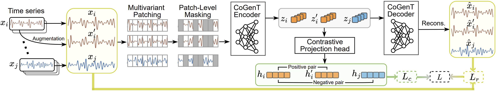

# CoGenT: A Unified Contrastive-Generative Framework for Time Series Classification. 

> Published in IEEE Transactions on AI | [arXiv:2508.09451](https://arxiv.org/pdf/2508.09451)   
> Authors: Ziyu Liu (ziyu.liu2@student.rmit.edu.au), Azadeh Alavi, Minyi Li, Xiang Zhang.

# Overview
CoGenT is a unified self-supervised learning framework for time series that brings together the strengths of both contrastive and generative representation learning. Instead of relying on a single paradigm, CoGenT combines representation alignment with masked reconstruction within one architecture, enabling the model to learn features that are simultaneously discriminative and structure-aware. This unified design makes CoGenT broadly effective across diverse time-series datasets and tasks, while remaining simple, lightweight, and easy to integrate into existing pipelines.  

Framework of the proposed CoGenT:  



# Key Contributions & Results

- Unified contrastive–generative framework: Combines representation alignment and masked reconstruction in one architecture to learn both discriminative and structure-aware time-series features.

- Consistent improvements across six datasets: CoGenT outperforms the standard SimCLR and MAE on all evaluated datasets covering different channels, frequencies, and class counts.

- Strong overall performance: Achieves top F1 scores such as 0.9652 on FD and 0.9131 on FordA, with CoGenT delivering substantial gains over contrastive-only and generative-only baselines.

# Installation

```
# Clone
git clone https://github.com/DL4mHealth/cogent.git
cd cogent

# Create a Python environment
python -m venv .venv
source .venv/bin/activate    # mac/linux
# .venv\Scripts\activate     # windows

pip install -r requirements.txt
```
`requirements.txt` should include:
```
einops==0.8.1
numpy==1.24.3
pandas==2.0.3
PyYAML==6.0.3
scikit_learn==1.3.0
scipy==1.10.1
sktime==0.29.1
timm==0.6.12
torch==2.4.1
torchmetrics==1.4.0.post0
tqdm==4.66.5
ucimlrepo==0.0.7
```
